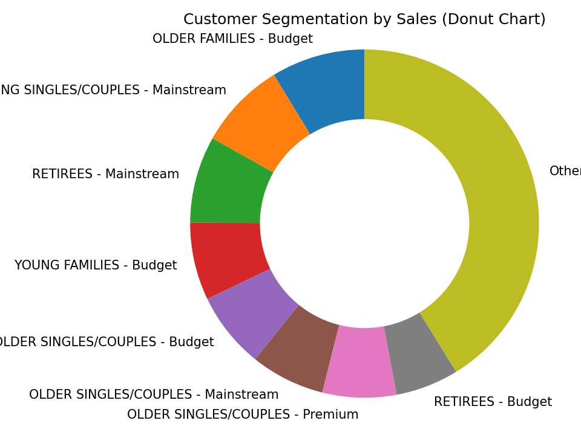
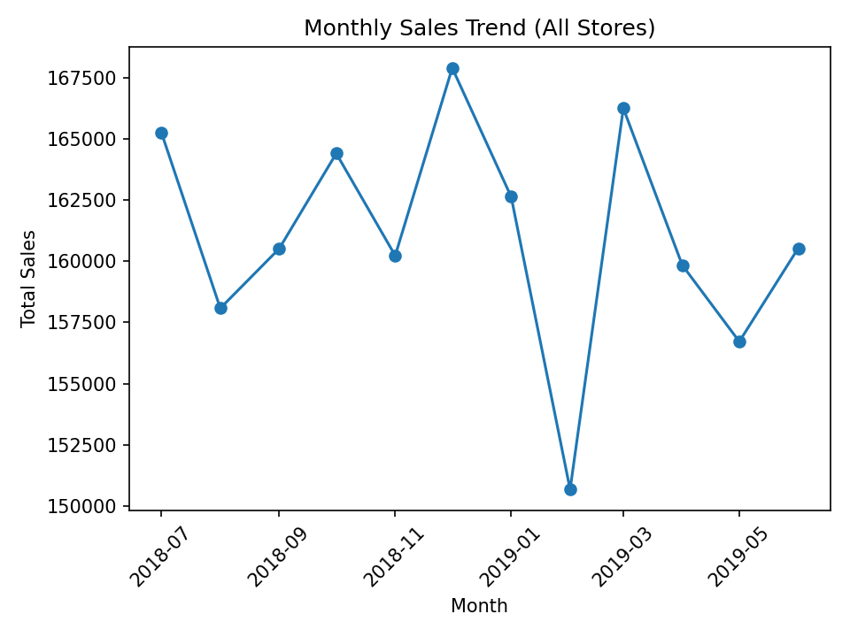
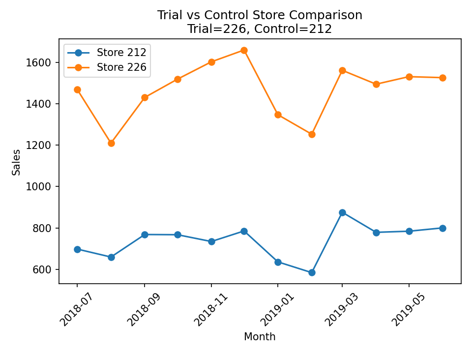

# Quantium_retail_analytics

This repository contains my end-to-end data analytics project completed as part of the **Quantium x Forage Virtual Internship**.  
The project focuses on analysing customer purchasing behaviour, preparing data pipelines, generating insights for a brand/category review, and selecting a statistically matched control store using advanced analytical techniques.

---

## 🧠 Project Overview

Quantium, a leader in retail data analytics, provided real-world transaction datasets from a chips category.  
The goal of the project was to answer key business questions related to customer behaviour, segment performance, sales trends, and controlled experimentation design.

This project demonstrates an industry-standard analytics workflow:
- Data preparation  
- Cleaning and transformation  
- Exploratory Data Analysis (EDA)  
- Customer segmentation  
- Statistical testing (t-tests, percentage differences)  
- Trial vs. control store selection  
- Business insights and recommendations  

---

## 📁 Repository Structure

quantium-retail-analytics/
│
├── data/
│ ├── raw/ # original QVI transaction & purchase behaviour datasets
│ ├── cleaned/ # cleaned data after wrangling and feature engineering
│ └── final/ # aggregated datasets used for insights and comparisons
│
├── notebooks/
│ ├── 01_data_preparation_and_analysis.ipynb
│ └── 02_control_store_selection.ipynb
│ └── 03_sample_vis.ipynb 
|
├── images 
|
├── presentation/
│ └── presentation_guide_BRAND.pptx # business presentation summarizing insights
│
└── README.md

---

## 🛠 Tools & Technologies

| Category | Tools |
|---------|--------|
| Programming | **Python (Pandas, NumPy, Statsmodels, Matplotlib)** |
| Environment | Jupyter Notebook |
| Data | QVI transaction data, purchase-behaviour data |
| Presentation | PowerPoint (customer insights & executive summary) |
| Version Control | Git & GitHub |

---

## 🔍 Key Tasks & Insights

### **1️⃣ Task 1 — Data Preparation & Customer Behaviour Analysis**
- Cleaned and standardized transaction records  
- Identified outliers and removed invalid transactions  
- Extracted product metadata (brand, size, packet type)  
- Performed exploratory analysis on:  
  - customer segments  
  - basket sizes  
  - purchase frequency  
  - price sensitivity  
- Generated insights on customer demographics and high-value shoppers  
- Created visuals to support category review  

---

### **2️⃣ Task 2 — Trial Store Analysis & Control Store Matching**
- Aggregated sales & customer counts at monthly level  
- Calculated scaling factors for stores  
- Measured correlation between stores using:  
  - sales  
  - number of customers  
- Selected most similar store using combined scoring  
- Conducted statistical inference using:  
  - t-tests  
  - percentage difference analysis  
- Evaluated uplift during trial period  

---

### **3️⃣ Presentation for Stakeholders**
A business-ready PowerPoint presentation summarizing:
- customer behaviour  
- period-over-period trends  
- trial vs. control store results  
- recommendations for the category manager  

File:  
`presentation/presentation_guide_BRAND.pptx`

---

## 📊 Sample Visuals

<table style="width:100%; table-layout:fixed; border-collapse:collapse;">
  <tr>
    <td align="center" style="padding: 20px; vertical-align: top;">
      <h3 style="margin-bottom: 10px;">Customer Segmentation Donut Chart</h3>
      
    </td>
    <td align="center" style="padding: 20px; vertical-align: top;">
      <h3 style="margin-bottom: 10px;">Monthly Sales Trend</h3>
      
    </td>
    <td align="center" style="padding: 20px; vertical-align: top;">
      <h3 style="margin-bottom: 10px;">Trial vs Control Store Comparison</h3>
      
    </td>

  </tr>
</table>

---

## 🎯 What I Learned

This project strengthened my skills in:
- end-to-end data analytics workflows  
- data cleaning and wrangling for large retail datasets  
- statistical methods for A/B testing and store matching  
- translating data insights into business recommendations  
- preparing executive-level presentations  

---

## 📢 Acknowledgement

This project was completed as part of the **Quantium Retail Analytics Virtual Experience Program** provided by **The Forage**.

---

## License

This project is released under the MIT License. You are free to use, modify, and distribute the code with proper attribution.
